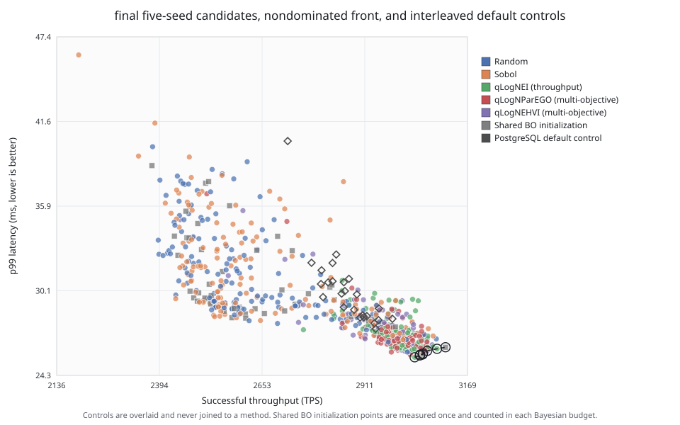
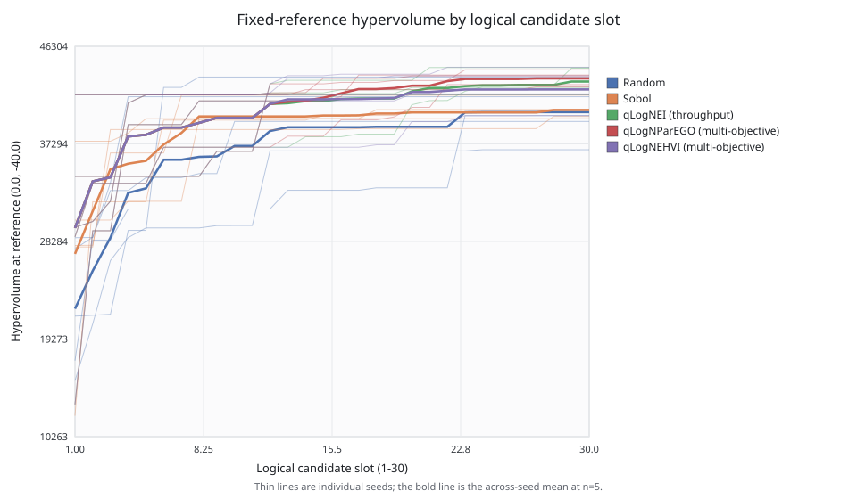
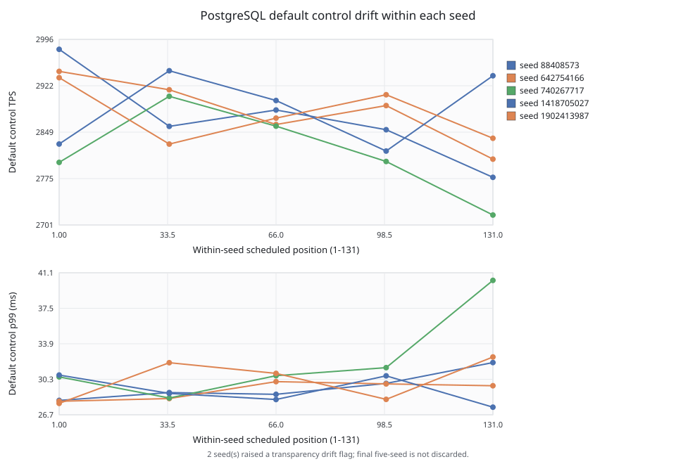

# Results and discussion

## Experimental scope

This study compares five strategies for allocating a bounded PostgreSQL tuning
budget: random search, scrambled Sobol search, throughput-oriented qLogNEI,
multi-objective qLogNParEGO, and multi-objective qLogNEHVI. The objectives are
throughput and p99 transaction latency. Execution validity and common hard safety
gates determine whether measurements are admissible; no learned feasibility
constraint is claimed. PostgreSQL default is an interleaved reference rather
than an optimization method consuming candidate slots.

The final comparison uses five independent seeds and 30 logical candidate slots
per method per seed. Within each seed, the three Bayesian methods share 12
initial observations and then receive 18 method-specific adaptive proposals.
Thus, 750 logical method slots correspond to 630 distinct physical candidate
observations. Five default controls per seed bring the physical total to 655.
Shared initial observations improve comparability of starting conditions but
must not be counted as independent replications across methods.

The workload is pgbench's TPC-B-like transaction mix at scale 500 and concurrency
32, using four client threads. The recorded target is PostgreSQL 18.1 in a
container limited to four CPUs and 4 GiB memory. Each F3 evaluation follows a
logical candidate restore, fingerprint verification, unconditional restart,
600-second warm-up and 600-second measurement. Timed workload invocations use
the frozen baseline-only maintenance policy. These are local research results,
not official audited TPC benchmark results.

The search covers eight PostgreSQL knobs: shared buffers, effective cache size,
work memory, checkpoint timeout, checkpoint completion target, maximum WAL size,
random page cost, and maximum parallel workers per gather. Durability safeguards
remain fixed. The screening stage did not establish a stable causal importance
ranking: its p99 drift gate failed, and its completed observations were used only
under a disclosed exploratory amendment. The eight-dimensional prospective
comparison was frozen after that decision.

## Primary comparison

The main empirical separation concerns the quality of candidates encountered
within the available budget. Table 1 reports the final five-seed aggregates
relative to the same-seed interpolated default. A negative TPS difference denotes
lower throughput; a negative p99 difference denotes lower latency. Local
domination requires a candidate to satisfy the analysis's joint TPS/p99 comparison
with its contemporaneous default.

**Table 1. Candidate quality in the five-seed primary cohort.**

| Method | Candidates dominating local default | Mean relative TPS | Mean p99 difference |
|---|---:|---:|---:|
| Random | 20/150 (13.3%) | -8.322% | +1.304 ms |
| Sobol | 28/150 (18.7%) | -7.413% | +1.364 ms |
| Throughput qLogNEI | 99/150 (66.0%) | -0.267% | -1.395 ms |
| qLogNParEGO | 102/150 (68.0%) | -0.272% | -1.530 ms |
| qLogNEHVI | 95/150 (63.3%) | -0.946% | -1.232 ms |

Source: final five-seed analysis and its method/seed tables. The domination
fractions are descriptive counts, not 150 independent replications per method.

The Bayesian methods proposed locally dominating configurations in roughly
63–68% of logical slots, compared with 13–19% for random and Sobol search.
Their mean throughput stayed closer to the local default, while mean p99 latency
improved. Random and Sobol candidates incurred larger average throughput losses
and positive mean latency differences. These results support reliable budget
allocation and avoidance of poor candidates under the tested conditions.

They do not establish universal raw-speed superiority. The five-seed mean of
the best throughput found in each seed ranges from 3003.930 TPS for random to
3064.230 TPS for qLogNParEGO. Finding a high extreme and avoiding degradation
throughout the candidate budget are different properties. The stronger practical
distinction here is the latter. The result does not imply that every Bayesian
candidate improves on default, nor that mean throughput is higher than default.

**Figure 1.** Throughput/p99 candidate and Pareto display from the unified final
five-seed report. Interpret joint quality alongside Table 1 and the seed-level
tables, rather than selecting one favorable configuration as the complete result.

**Figure 2.** Hypervolume progression under the frozen reference point
`(TPS=0, -p99=-40)`. Hypervolume is a joint summary of the same throughput and
latency measurements; it is not an independent experimental outcome stream.

The accompanying best-throughput and minimum-p99 trajectory figures show the
other budget-dependent endpoints. Their underlying candidate and seed tables
are included in the submission package so that aggregate displays can be traced
back to the measured cohort.

## Uncertainty and drift

Seed is the independent unit for the registered statistical comparisons.
The five endpoints are final hypervolume, best throughput, minimum p99,
mean control-relative throughput, and mean control-relative p99. They retain
the registered paired, exact, two-sided permutation analysis, with multiplicity
adjustment within each endpoint family. Five paired seeds impose a minimum
unadjusted p-value of 0.0625. These data therefore do not yield a conventional
p<0.05 superiority result under the frozen test. Bootstrap intervals and
per-seed directions describe practical uncertainty but do not remove the small
number of independent replications.

For example, the final bootstrap interval for mean control-relative TPS spans
approximately -0.81% to +0.28% for qLogNEI, -1.00% to +0.46% for qLogNParEGO,
and -2.05% to -0.20% for qLogNEHVI. The complete precision and paired-contrast
tables should accompany these rounded examples. The protocol does not support
a qLogNParEGO-versus-qLogNEHVI winner; descriptive endpoint ordering must not
be converted into such a claim.

The cohort outcome is `COMPLETE_WITH_DRIFT_FLAGS`. Seed 88408573 exceeded the
transparency-only TPS drift threshold. Seed 740267717 exceeded the p99 threshold,
with a fitted change of 9.002 ms. Both seeds remain in the analysis. Interleaved
controls support local adjustment, but they do not prove the absence of all
environmental confounding or justify discarding unfavorable observations.

**Figure 3.** Default-control drift within the final cohort. The flagged evidence
is retained in the reported results.

## Measurement fidelity and operational cost

The retrospective multi-fidelity analysis evaluates 60- and 120-second prefixes
of the 393 physical F3 observations from the initial three-seed cohort. Both
windows passed the registered per-seed correlation and zero-false-rejection
gates. The short rule uses prefix throughput relative to its same-window local
default and does not impose a p99 constraint. Retrospective modeled savings
were 1.200 hours for the 60-second window and 0.133 hours for the 120-second
window, corresponding to 0.660% and 0.073% of the modeled lifecycle totals.

The separately authorized live demonstration completed 35 observations over one
seed. Of 30 candidates, 29 promoted and one was rejected. The rejection avoided
540 seconds of F3 continuation, saving 0.946% of matched all-F3 lifecycle time.
The observed runtime-model error was 2.303%, within the frozen 10% gate.
The rejected candidate has no F3 counterfactual by design, so the live block
does not directly establish its false-rejection status or a general rejection rate.

The small realized saving is an informative operational result. Logical restore,
restart and the full warm-up are paid before the prefix can reject a candidate.
Shortening only the measurement continuation therefore saves little of the full
lifecycle. Larger savings would require evidence that a different fidelity can
also reduce a substantial fixed cost. That possibility was not tested here.

## Reliability and finalist deployment

All 655 primary physical observations completed validly. Their append-only
history contains 657 attempts: 655 completed attempts and two failed
infrastructure attempts. One failure occurred during dataset restoration and
one during a host-power interruption. Both were retried on their original
candidate slots; neither consumed an additional candidate slot.

**Table 2. Corrected physical attempt accounting.**

| Quantity | Count |
|---|---:|
| Completed physical observation slots | 655 |
| Total attempts, including first attempts | 657 |
| Retained failed attempts | 2 |
| Slots requiring a retry | 2 |

This table incorporates the D072 reporting erratum. The historical report
mistakenly treated a total-attempt counter as a retry count. Both failures
concern shared BO initialization and are attributed to each BO method for
logical accounting; they remain two physical events rather than six. The
correction changes neither measurements nor performance endpoints. The
historical safety figure's caption should not be reused; the corrected table
and erratum in this package replace its accounting narrative.

F4 confirmation tested four finalists and default across four common-seed
blocks, for 20 observations. All finalists passed the frozen practical gates.
The latency-first selection rule recommended configuration E, with mean p99
25.952 ms, mean same-block TPS improvement 5.118%, and mean p99 reduction
3.389 ms relative to default. Four blocks support a bounded repeated
configuration recommendation, not a population-superiority claim or ranking
of optimizer families.

The deployment workflow captured the previous configuration, applied E,
restarted PostgreSQL, verified active settings and health, and demonstrated
exact rollback. Persistent activation occurred only after a separate operator
authorization. Deployment verification establishes that the selected settings
can be applied and recovered on the recorded target; it supplies no additional
production-performance estimate.

## Limitations and conclusion

The final evidence is restricted to one OLTP workload and recorded host/container
context. It does not establish transfer to analytical, read-heavy, mixed or
hidden workloads, other scales/concurrency settings, other hardware or other
database engines. Calibration did not provide the class variation needed for
a defensible learned constraint. The study therefore makes no learned-risk
calibration, coordinated knob/index, workload-transfer or drift-adaptation claim.
The original broader experimental matrix and ablations were not completed by
this narrowed comparison.

The duration pilot used a conservative futility stop rather than completing
every planned measurement. Screening remained drift-limited. The multi-fidelity
live result uses only one seed, F4 has four blocks, and the primary comparison
has five independent seeds. Recovery demonstrations and long campaign execution
must not be relabelled as completion of separately specified one-hour or
24-hour soak protocols. A local backup restoration is likewise distinct from
an independent clean-machine experiment reproduction.

Within these boundaries, the study contributes an auditable comparison of
five tuning strategies and evidence that Bayesian candidate selection more
reliably avoids degradation within a fixed budget. It also documents the limited
benefit of shortening measurement alone when restoration and warm-up dominate
the lifecycle. These empirical and engineering findings are the supported
contribution; no new literature-level novelty or universal superiority claim
is inferred from them.

## Evidence references for manuscript integration

- Final analysis payload SHA-256:
  `769f5a0eabdebe272a0a8ae4b7578fd54f72d4a95cd53822e1cb993466a36fb2`.
- Original final report index file SHA-256:
  `97a37d469ca515a4fb4889f6548c8c42ff33b85b1a41d6504dc2e4b551747fd2`.
- Statistical tables: `tables/seed-level-statistics.csv`,
  `tables/pairwise-contrasts.csv`, and `tables/seed-method-outcomes.csv` in the
  submission package. Performance tables preserve the frozen numeric values.
- Corrected accounting: `tables/safety-accounting-correction.csv` and
  `safety-accounting-erratum.md` in the submission package.
- Frozen profile, methodology, decisions and current acceptance assessment:
  the source archive's `docs/methodology.md`, `docs/limitations.md`,
  `docs/reproducibility.md`, and `docs/history/continuation/ACCEPTANCE_CRITERIA-original.md`.

This chapter is ready for author integration into the main manuscript. Chapter
numbering, institutional formatting and bibliography cross-references belong
to that manuscript; none was available in the repository at packaging time.
